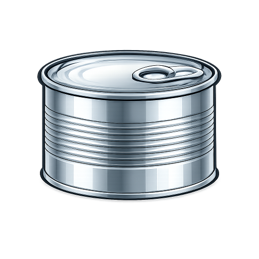

# Can Framework Support



Official Visual Studio Code support for the **Can Framework**. This extension provides a rich development experience for building reactive web applications using `.can` files.

## Features

### 🚀 Language Server Support (LSP)
- **IntelliSense**: Smart code completion for framework keywords (`signal`, `computed`, `effect`), HTML tags within templates, and CSS properties in scoped styles.
- **Hover Documentation**: Instantly view documentation for framework primitives by hovering over them.
- **Go to Definition**: Navigate directly to imported components or class definitions using `F12` or `Ctrl+Click`.
- **Real-time Diagnostics**: Immediate feedback on syntax errors and compiler warnings directly in the editor.
- **Document Formatting**: Automatic code formatting and indentation for clean, consistent codebases.
### 🛠️ Recommended Configuration

To get the best experience, including **Format on Save**, add the following to your VS Code `settings.json`:

```json
"[can]": {
    "editor.defaultFormatter": "can-framework.can-language-support",
    "editor.formatOnSave": true,
    "editor.tabSize": 4,
    "editor.semanticHighlighting.enabled": true
}
```

### 🎨 Syntax Highlighting
- High-performance colorization for Can-specific syntax, including the `component` block, reactive signals, and embedded HTML/CSS.
- Support for `c-if`, `c-for`, `c-model`, and other framework directives.

### 📝 Snippets
- `component-boilerplate`: Quickly scaffold a new Can component with template and reactive state.

## Usage

1. Install the extension.
2. Open any `.can` file.
3. The Language Server will activate automatically, providing live feedback as you type.

## Commands

This extension contributes the following commands to the Command Palette (`Ctrl+Shift+P`):

- `Can: Show Info`: Displays status information about the Can Framework extension.
- `Can: Restart Server`: Manually restarts the Language Server if needed.

## Screenshots

### Syntax Highlighting & IntelliSense


## Requirements

- **Node.js**: Required to run the Language Server.
- **Can Framework**: This extension is designed to work with projects using the Can Framework ecosystem.

## Known Issues

- Snippet performance may vary based on the complexity of the workspace.
- CSS completion is currently limited to standard property names.

## Release Notes

### 0.0.7
- Enhanced semantic highlighting for `props` and `this` keywords.
- Improved Outline view accuracy for signals vs fields.
- Fixed theme mapping for reactive functions.

## 0.0.6

### 0.0.5

### 0.0.4
- Added support for CSS property completion.
- Improved snippet performance and stability.
- Fixed an issue with snippet insertion when using the `Tab` key.

### 0.0.3 
- Added support for CSS property completion.
- Improved snippet performance and stability.
- Fixed an issue with snippet insertion when using the `Tab` key.

### 0.0.2
- Added full Language Server Protocol (LSP) integration.
- Implemented Go

### 0.0.3 
- Added support for CSS property completion.
- Improved snippet performance and stability.
- Fixed an issue with snippet insertion when using the `Tab` key.


### 0.0.2
- Added full Language Server Protocol (LSP) integration.
- Implemented Go to Definition for components.
- Added automatic document formatting.
- Improved syntax highlighting for reactive signals (`@` prefix).

### 0.0.1
- Initial release with basic syntax highlighting and snippets.
